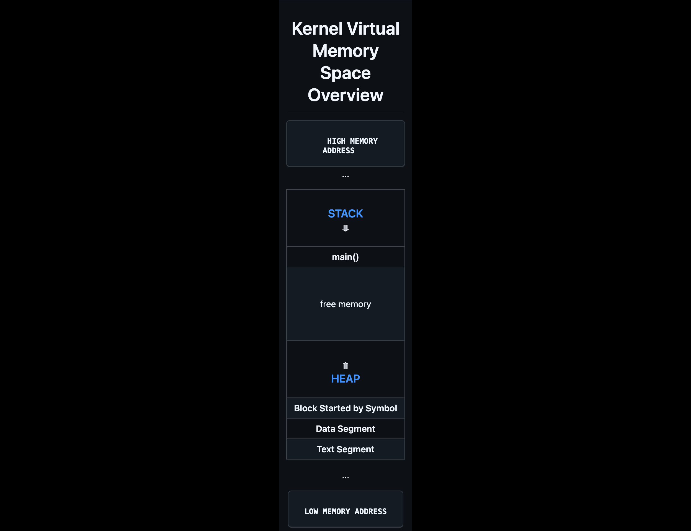

layout: true

.signature[@algogrit]

---

class: center, middle

# Rust Refresher

Gaurav Agarwal

---

## Variables

- Immutable by default
- Strongly typed
- Type inferred
- Shadowing
- No default values
- Scope & Lifetimes (*more later*)

---

Scalar & Compound Types

---

## Functions

- `main`
- expressions
- implicit `return`

---

## Flow Control

- `if` ... `else`

- `loop`

- `while`

- `for _ in _`

---
class: center, middle

## Memory Layout

---
class: center, middle

.content-credits[https://github.com/amindWalker/Rust-Layout-and-Types/blob/main/README.md]

---

### Text Segment

The text segment, aka the code segment, is where the Rust code is compiled by LLVM into machine code and stored for later execution. The actual execution of the machine code instructions typically occurs elsewhere in memory.

---

### Data Segment

The data segment in a program's memory layout is used to store initialized variables, which have a defined value at runtime.

---

### BSS

The Block Started by Symbol (BSS) section contains the uninitialized variables.

---
class: center, middle

### Stack vs Heap

---
class: center, middle

## Heap Memory management via Ownership

---
class: center, middle

Code
https://github.com/algogrit/presentation-rust-refresher

Slides
https://rust-refresher.slides.algogrit.com
